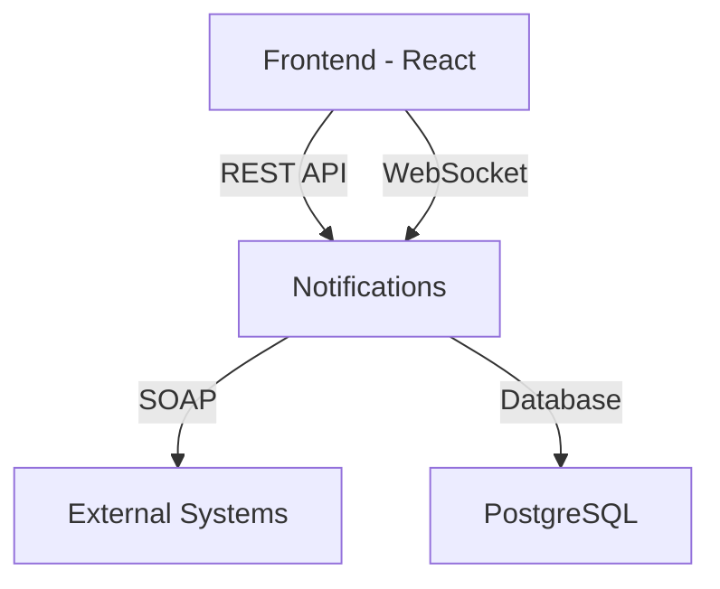

# NBP Exchange Rates Monitoring System

A modern web application for monitoring National Bank of Poland (NBP) exchange rates with SOAP API integration, built with FastAPI backend and React frontend.

## Features

### Core Functionality
- **Real-time Exchange Rates**: Fetches and displays current exchange rates from NBP API
- **Historical Data**: View historical exchange rate trends with interactive charts
- **SOAP API Integration**: Includes a fully functional SOAP service for enterprise integration
- **User Authentication**: Secure login and session management
- **Notification System**: Configure alerts for specific exchange rate thresholds

### Technical Highlights
- **Microservices Architecture**: Docker containers for backend, frontend, and database
- **Modern Stack**: FastAPI (Python) backend + React (JavaScript) frontend
- **Production-Ready**: Nginx reverse proxy, PostgreSQL database, and proper environment configuration
- **CI/CD Ready**: Dockerized setup makes it deployment-ready for any cloud platform

## System Architecture



## Getting Started

### Prerequisites
- Docker 20.10+
- Docker Compose 2.0+
- Node.js 16+ (for frontend development)

### Installation
1. Clone the repository:
   ```bash
   git clone https://github.com/yourusername/nbp-exchange-monitor.git
   cd nbp-exchange-monitor
   ```

2. Create `.env` file (see [Configuration](#configuration) section)

3. Start the system:
   ```bash
   docker-compose up --build
   ```

4. Access the application:
   - Frontend: http://localhost:3000
   - Backend API: http://localhost:8000
   - SOAP Service: http://localhost:8001/soap?wsdl

## Configuration

Create a `.env` file in the project root with these variables (example values shown):

```ini
# Database
POSTGRES_USER=nbp_user
POSTGRES_PASSWORD=secure_password
POSTGRES_DB=nbp_data

# Backend
SECRET_KEY=your-secret-key-here
ALGORITHM=HS256
ACCESS_TOKEN_EXPIRE_MINUTES=30

# NBP API
NBP_API_URL=https://api.nbp.pl/api/exchangerates
NBP_API_TIMEOUT=10

# SOAP Service
SOAP_SERVICE_HOST=0.0.0.0
SOAP_SERVICE_PORT=8001
```

## Development

### Backend Development
```bash
cd backend
python -m venv venv
source venv/bin/activate  # On Windows: venv\Scripts\activate
pip install -r requirements.txt
uvicorn app.main:app --reload
```

### Frontend Development
```bash
cd frontend
npm install
npm start
```

## API Documentation

### REST API
Available at http://localhost:8000/docs (Swagger UI) or http://localhost:8000/redoc

### SOAP API
WSDL available at http://localhost:8001/soap?wsdl

Example SOAP request:
```xml
<soapenv:Envelope xmlns:soapenv="http://schemas.xmlsoap.org/soap/envelope/" xmlns:nbp="http://nbp.pl/">
   <soapenv:Header/>
   <soapenv:Body>
      <nbp:GetCurrentExchangeRate>
         <currency>EUR</currency>
      </nbp:GetCurrentExchangeRate>
   </soapenv:Body>
</soapenv:Envelope>
```

## Deployment

The system is ready for deployment to any Docker-supported platform. For production:

1. Set `NODE_ENV=production` in frontend Dockerfile
2. Configure proper CORS origins in backend environment
3. Set up HTTPS with proper certificates
4. Consider using a managed PostgreSQL service for production database

Example deployment to AWS ECS:
```bash
docker-compose -f docker-compose.prod.yml up --build
```

## Contributing

1. Fork the project
2. Create your feature branch (`git checkout -b feature/AmazingFeature`)
3. Commit your changes (`git commit -m 'Add some AmazingFeature'`)
4. Push to the branch (`git push origin feature/AmazingFeature`)
5. Open a Pull Request

## License

Distributed under the MIT License. See `LICENSE` for more information.

## Contact

Project Maintainer: [Your Name] - your.email@example.com  
Project Link: [https://github.com/yourusername/nbp-exchange-monitor](https://github.com/yourusername/nbp-exchange-monitor)

## Acknowledgments
- National Bank of Poland for their public API
- FastAPI and React communities for excellent documentation
- Docker for containerization technology
