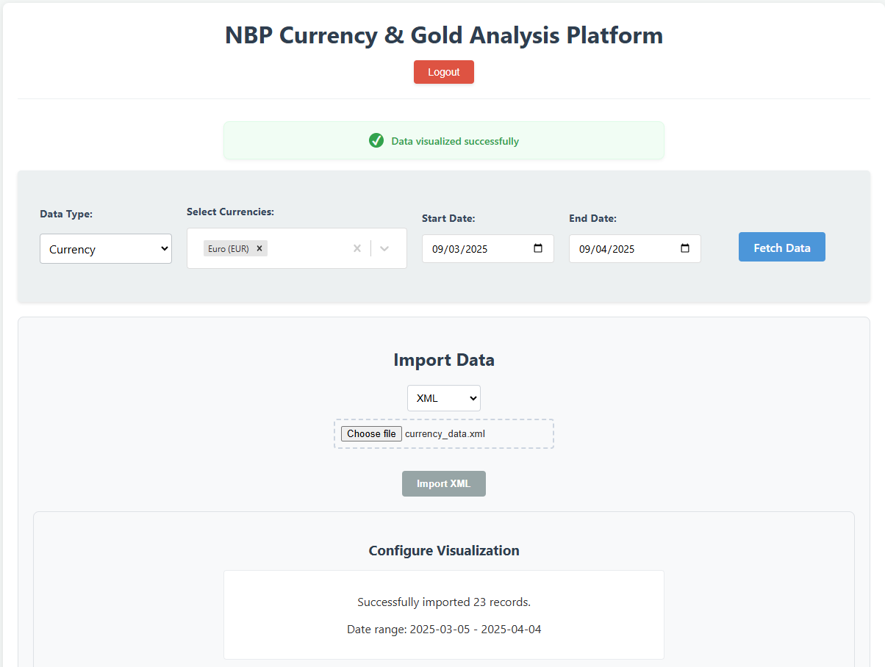

# NBP Exchange Rates Monitoring System

 


## Features

### Core Functionality
- **Real-time Exchange Rates**: Fetches current rates from NBP API every hour
- **Historical Data Analysis**: Interactive charts with 30-day rate history
- **Dual API Integration**:
  - REST API for modern web clients
  - SOAP API for enterprise system integration
- **Secure Authentication**: JWT-based auth with password hashing
- **Rate Alerts**: Email notifications when rates hit user-defined thresholds

### Technical Implementation
- **Transaction Management**: ACID-compliant database operations
- **Data Isolation**: Read-committed isolation level for concurrent access
- **API Documentation**: Auto-generated Swagger/OpenAPI docs
- **Containerized**: Docker Compose for easy deployment

## System Architecture


## Getting Started

### Prerequisites
- Docker 20.10+
- Docker Compose 2.0+
- Node.js 16+ (for frontend development)

### Quick Start
```bash
git clone https://github.com/KaloeSan/nbp-exchange-monitor.git
cd nbp-exchange-monitor
cp .env.example .env
docker-compose up --build
```

Access the application:
- Frontend: http://localhost:3000
- Backend API: http://localhost:8000/docs
- SOAP WSDL: http://localhost:8001/soap?wsdl

## Key Technical Components

### Backend Services
- **Data Fetching**: Scheduled NBP API polling with retry logic
- **Database Layer**: SQLAlchemy ORM with async support
- **SOAP Service**: Zeep-based implementation with WSDL generation
- **Authentication**: OAuth2 with JWT tokens

### Frontend Features
- **Rate Dashboard**: Real-time updates via WebSocket
- **Chart Visualization**: React-ChartJS for historical data
- **Responsive Design**: Mobile-friendly interface

## API Examples

### REST API
```bash
# Get current EUR rate
curl -X 'GET' \
  'http://localhost:8000/api/v1/rates/EUR' \
  -H 'accept: application/json' \
  -H 'Authorization: Bearer YOUR_TOKEN'
```

### SOAP API
```xml
<soapenv:Envelope xmlns:soapenv="http://schemas.xmlsoap.org/soap/envelope/" 
                  xmlns:nbp="http://nbp.pl/">
   <soapenv:Header/>
   <soapenv:Body>
      <nbp:GetHistoricalRates>
         <currency>USD</currency>
         <days>30</days>
      </nbp:GetHistoricalRates>
   </soapenv:Body>
</soapenv:Envelope>
```

## Development Workflow

### Backend
```bash
cd backend
python -m venv venv
source venv/bin/activate
pip install -r requirements.txt
uvicorn app.main:app --reload
```

### Frontend
```bash
cd frontend
npm install
npm start
```

## Deployment Options

### Production Checklist
1. Set `NODE_ENV=production` in frontend build
2. Configure HTTPS with valid certificates
3. Implement database backups
4. Set up monitoring (Prometheus/Grafana)

### Cloud Deployment
```bash
# Example for AWS ECS
docker-compose -f docker-compose.prod.yml up --build -d
```

## Project Structure

```
nbp-exchange-monitor/
├── backend/              # FastAPI application
│   ├── app/              # Main application code
│   ├── Dockerfile        # Container configuration
│   └── requirements.txt  # Python dependencies
├── frontend/             # React application
│   ├── public/           # Static assets
│   ├── src/              # React components
│   └── Dockerfile        # Frontend container
└── docker-compose.yml    # Orchestration
```

## Contact

For questions or support, please contact:  
Kamil Kostka - kamilkostka6@gmail.com  
Project Repository: [github.com/KaloeSan/nbp-exchange-monitor](https://github.com/KaloeSan/nbp-exchange-monitor)
